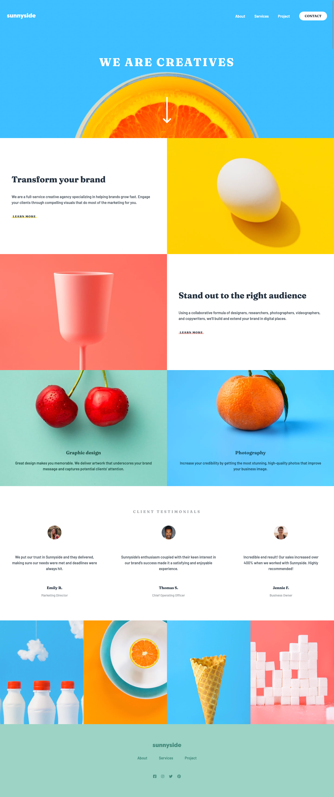
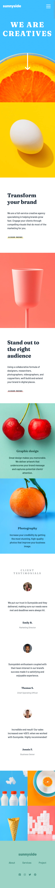

# Frontend Mentor - Sunnyside agency landing page solution

### Design Preview

This is a solution to the [Sunnyside Agency landing page challenge on Frontend Mentor](https://www.frontendmentor.io/challenges/sunnyside-agency-landing-page-7yVs3B6ef). Frontend Mentor challenges help you improve your coding skills by building realistic projects.

## Table of contents

- [Overview](#overview)
  - [The challenge](#the-challenge)
  - [Screenshot](#screenshot)
  - [Links](#links)
- [My process](#my-process)
  - [Built with](#built-with)

## Overview

### The challenge

- Build out the project to the designs provided

### Screenshot

### Links

- Solution URL: [https://github.com/sjneri/sunnyside-landing](https://github.com/sjneri/sunnyside-landing)
- Live Site URL: [https://sjneri.github.io/sunnyside-landing/](https://sjneri.github.io/sunnyside-landing/)

## My process

### Built with

- Semantic HTML5 markup
- CSS custom properties
- Flexbox
- jQuery